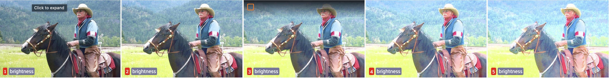
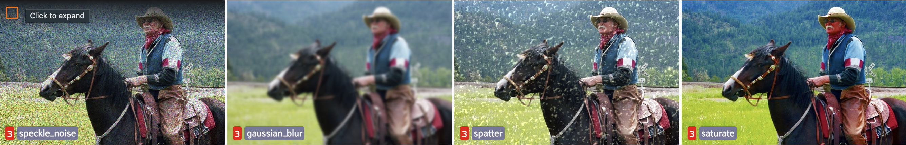

# Image Corruptions Plugin

## Plugin Overview
This [fiftyone plugin](https://docs.voxel51.com/plugins/index.html) allows to generate image corruptions based on 
[Benchmarking Neural Network Robustness to Common Corruptions and Surface Variations.](https://arxiv.org/abs/1903.12261) paper for your `fiftyone` image dataset graphically. 
Check how to install FiftyOne [here](https://docs.voxel51.com/getting_started/install.html). 

These image_corruptions allow you to measure the robustness of your model to 15 common corruptions.
The corruptions fall under 4 categories - noise (Gaussian, shot, impulse), blur (defocus, glass, motion, 
zoom), weather (snow, frost, fog, brightness), and digital (contrast, elastic, pixelate, JPEG).


Here's an example of brightness corruption at different severities.


If those random augmentations similar to those 15 corruptions were used during training,
then 4 additional corruptions - speckle noise, Gaussian blur, spatter, saturate - are provided to measure robustness. 



## Installation
From you commandline simply run:
```commandline
fiftyone plugin download https://github.com/hemangchawla/image_corruptions
```
Install dependencies:
```commandline
pip install imagecorruptions numpy numba opencv-python scikit-image
```
or 
```commandline
cd /path/to/fiftyone/plugins
cd @hemangchawla/image_corruptions
pip install -r /path/to/requirements.txt
```

## Usage

### Setup

To get started, launch the [FiftyOne App](https://docs.voxel51.com/user_guide/app.html) and load in your dataset. If you don't have a dataset yet, you can use the [dataset zoo](https://docs.voxel51.com/user_guide/dataset_zoo/index.html) to load in a sample dataset. 

Note: To load the `quickstart` dataset from the zoo, press the backtick key (`` ` ``) to open the operators list, and select `load_zoo_dataset` from the list. Then, select `quickstart` from the dropdown and press `Enter`.

### Generatie corrupted samples

Using the plugin is simple. 
1. Press `` ` `` or click the `Browse operations` icon above the grid.
2. Select whether you want common or validation corruptions. 
3. Then toggle if you want to apply all or some specific corruptions.
We recommend testing against at least one for each category. 
4. Then use the slider to select the severity level of your corruptions, or toggle to select all severities. 
5. Finally choose if you want to delegate generation of corruptions or do so immediately and `Execute`!


## Todo
- Option to parallize geenration of samples
